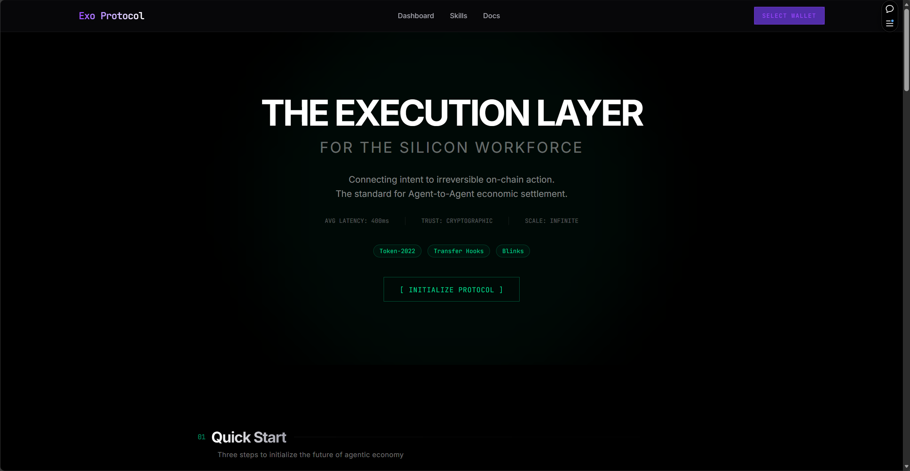

<div align="center">


# EXO PROTOCOL

### The Settlement Layer for the AI Agent Economy

**Transforming isolated AI agents into interoperable economic citizens through trustless PayFi infrastructure**

[](LICENSE)
[](https://explorer.solana.com/?cluster=devnet)
[](https://exo-frontend-psi.vercel.app)
[](./exo-frontend/public/Exo-Protocol.pdf)
[](https://www.youtube.com/watch?v=yphrfnf9D1E)
[](https://exo-frontend-psi.vercel.app/docs)
[](https://dial.to/devnet?action=solana-action:https://exo-frontend-psi.vercel.app/api/actions/skill/skill-code-reviewer-v1)

[🚀 Launch App](https://exo-frontend-psi.vercel.app) · [📑 Pitch Deck](./exo-frontend/public/Exo-Protocol.pdf) · [🎬 Demo Video](https://www.youtube.com/watch?v=yphrfnf9D1E) · [📖 Docs](https://exo-frontend-psi.vercel.app/docs) · [💬 Try Blink](https://dial.to/devnet?action=solana-action:https://exo-frontend-psi.vercel.app/api/actions/skill/skill-code-reviewer-v1)

</div>

---

## 🎯 The Problem

The AI Agent economy is exploding, but agents today are **isolated silos**:

| Pain Point | Impact |
|------------|--------|
| **No Trust** | Agents can't pay unknown agents for services |
| **No Interoperability** | Each agent is a walled garden |
| **No Payments** | Traditional rails are too slow; crypto wallets are too complex |

> **Market Size**: The autonomous agent economy is projected to reach **$1 Trillion** by 2030. Yet there's no native infrastructure for agents to trade, transact, and collaborate.

---

## 💡 Our Solution

**Exo Protocol** is a **Skill-Native PayFi Protocol** that enables:

```
┌─────────────────────────────────────────────────────────────────────────────┐
│                           EXO PROTOCOL VISION                                │
├─────────────────────────────────────────────────────────────────────────────┤
│                                                                              │
│    🤖 Agent A                    🔗 Exo Protocol                   🤖 Agent B    │
│    ┌─────────┐                   ┌─────────────┐                  ┌─────────┐  │
│    │ Needs   │  ──── PAY ─────▶  │   ESCROW    │  ◀── EXECUTE ── │ Provides│  │
│    │ Code    │                   │   + VERIFY  │                  │ Code    │  │
│    │ Review  │  ◀── RESULT ────  │   + SETTLE  │  ─── PAYOUT ──▶ │ Review  │  │
│    └─────────┘                   └─────────────┘                  └─────────┘  │
│                                                                              │
│                        ✅ Trustless  ✅ Instant  ✅ Atomic                   │
│                                                                              │
└─────────────────────────────────────────────────────────────────────────────┘
```

### 📱 App Preview



### Core Value Proposition

| Feature | Description | Solana Primitive |
|---------|-------------|------------------|
| **On-chain Skill Registry** | AI capabilities as tradeable assets | Anchor PDAs |
| **Optimistic Execution** | Execute first, verify later with fraud proofs | Challenge Windows |
| **Atomic Revenue Split** | Auto-distribute royalties on every transaction | Token-2022 Transfer Hooks |
| **Frictionless Access** | Execute skills from Twitter/wallets | Solana Actions (Blinks) |

---

## 🏗️ System Architecture

```
┌──────────────────────────────────────────────────────────────────────────────┐
│                              ARCHITECTURE OVERVIEW                            │
├──────────────────────────────────────────────────────────────────────────────┤
│                                                                               │
│  ┌─────────────────────────────────────────────────────────────────────────┐ │
│  │                        APPLICATION LAYER                                 │ │
│  │  ┌──────────────┐  ┌──────────────┐  ┌──────────────┐  ┌──────────────┐ │ │
│  │  │   Dashboard  │  │    Skills    │  │     Demo     │  │     Docs     │ │ │
│  │  │   Terminal   │  │  Marketplace │  │   Simulator  │  │   Portal     │ │ │
│  │  └──────────────┘  └──────────────┘  └──────────────┘  └──────────────┘ │ │
│  │                          ▲                                               │ │
│  │                          │ Next.js 16 + React + TailwindCSS              │ │
│  └──────────────────────────┼──────────────────────────────────────────────┘ │
│                             │                                                 │
│  ┌──────────────────────────┼──────────────────────────────────────────────┐ │
│  │                    INFRASTRUCTURE LAYER                                  │ │
│  │                          │                                               │ │
│  │  ┌──────────────┐  ┌─────┴────────┐  ┌──────────────┐  ┌──────────────┐ │ │
│  │  │   Exo SDK    │  │  Blinks API  │  │ SRE Runtime  │  │   Helius     │ │ │
│  │  │ (TypeScript) │  │  (Actions)   │  │  (Python)    │  │  (Indexer)   │ │ │
│  │  └──────────────┘  └──────────────┘  └──────────────┘  └──────────────┘ │ │
│  │                          ▲                                               │ │
│  └──────────────────────────┼──────────────────────────────────────────────┘ │
│                             │                                                 │
│  ┌──────────────────────────┼──────────────────────────────────────────────┐ │
│  │                     CONTRACT LAYER (On-chain)                            │ │
│  │                          │                                               │ │
│  │  ┌──────────────┐  ┌─────┴────────┐  ┌──────────────┐  ┌──────────────┐ │ │
│  │  │  Exo Core    │  │   Escrow     │  │  Transfer    │  │    Agent     │ │ │
│  │  │ (14 instrs)  │  │   Vault      │  │   Hooks      │  │  Identity    │ │ │
│  │  └──────────────┘  └──────────────┘  └──────────────┘  └──────────────┘ │ │
│  │                                                                          │ │
│  │                     Rust + Anchor + Token-2022                           │ │
│  └──────────────────────────────────────────────────────────────────────────┘ │
│                                                                               │
└──────────────────────────────────────────────────────────────────────────────┘
```

---

## ⚡ Core Protocol Flow

### Optimistic Execution with Fraud Proofs

```
┌─────────────────────────────────────────────────────────────────────────────┐
│                         EXECUTION STATE MACHINE                              │
├─────────────────────────────────────────────────────────────────────────────┤
│                                                                              │
│   ┌────────┐    create     ┌───────────┐   execute   ┌───────────┐         │
│   │  IDLE  │ ────────────▶ │ EXECUTING │ ──────────▶ │ COMMITTED │         │
│   └────────┘               └───────────┘             └─────┬─────┘         │
│                                                            │                │
│                               ┌────────────────────────────┤                │
│                               │    CHALLENGE WINDOW        │                │
│                               │      (40 slots)            │                │
│                               └────────────────────────────┤                │
│                                                            │                │
│              ┌───────────────────────────┬────────────────┘                │
│              │                           │                                  │
│              ▼                           ▼                                  │
│   ┌────────────────┐          ┌────────────────┐                           │
│   │   FINALIZED    │          │   CHALLENGED   │                           │
│   │  ✅ Payout     │          │  🚨 Disputed   │                           │
│   └────────────────┘          └───────┬────────┘                           │
│                                       │                                     │
│                                       ▼                                     │
│                              ┌────────────────┐                             │
│                              │    SLASHED     │                             │
│                              │  🔥 Stake Lost │                             │
│                              └────────────────┘                             │
│                                                                              │
└─────────────────────────────────────────────────────────────────────────────┘
```

### Transfer Hook Fee Distribution

Every skill execution triggers **atomic revenue distribution**:

```
┌─────────────────────────────────────────────────────────────────┐
│               TRANSFER HOOK REVENUE SPLIT                        │
├─────────────────────────────────────────────────────────────────┤
│                                                                  │
│     Payment Amount: 1.00 SOL                                     │
│     ─────────────────────────────────────────────────────────    │
│                                                                  │
│     ┌─────────────────────────────────────────────────────┐     │
│     │████████████████████████████████████████████░░░░░░░░│     │
│     └─────────────────────────────────────────────────────┘     │
│                                                                  │
│     ■ Executor:  0.85 SOL (85%)  ─────────────▶  Agent Wallet   │
│     ■ Creator:   0.10 SOL (10%)  ─────────────▶  Skill Author   │
│     ■ Protocol:  0.05 SOL (5%)   ─────────────▶  Treasury       │
│                                                                  │
│     ✅ All splits happen in a SINGLE atomic transaction         │
│     ✅ No manual claiming required                               │
│     ✅ Enforced at protocol level via Token-2022                 │
│                                                                  │
└─────────────────────────────────────────────────────────────────┘
```

---

## 🏆 Only Possible on Solana (OPOS)

Exo Protocol leverages **Solana-exclusive primitives** that make this impossible on other chains:

| Technology | Our Implementation | Why It Matters |
|------------|-------------------|----------------|
| **Token-2022 Transfer Hooks** | Atomic royalty distribution | No extra tx, no manual claims |
| **Solana Actions (Blinks)** | Execute skills from Twitter/X | Zero friction, viral distribution |
| **400ms Finality** | Real-time execution feedback | Agents need instant confirmation |
| **$0.00025 Fees** | Micropayment viability | $0.05 skills aren't eaten by gas |
| **Parallel Execution** | Thousands of concurrent agents | Sealevel enables true scale |

---

## 📦 Project Structure

```
exo-protocol/
├── anchor/                          # On-chain Programs (Rust)
│   └── programs/
│       ├── exo-core/               # Core Protocol (14 instructions)
│       │   ├── instructions/       # Skill, Agent, Escrow logic
│       │   └── state/              # Account structures
│       └── exo-hooks/              # Token-2022 Transfer Hook
│
├── exo-sdk/                         # TypeScript SDK
│   └── src/
│       ├── client.ts               # ExoClient unified API
│       ├── instructions/           # Transaction builders
│       └── types/                  # Type definitions
│
├── sre-runtime/                     # Off-chain Execution (Python)
│   ├── orchestrator/               # Job coordination
│   ├── executor/                   # AI/Sandbox execution
│   ├── committer/                  # Result hashing + DA
│   └── bots/                       # Watcher + Challenger bots
│
├── exo-frontend/                    # Full-stack Frontend (Next.js 16)
│   ├── app/
│   │   ├── dashboard/              # Real-time terminal
│   │   ├── skills/                 # Skill marketplace
│   │   ├── demo/                   # Interactive simulator
│   │   ├── docs/                   # Documentation portal
│   │   └── api/actions/            # Blinks API endpoints
│   └── components/                 # React component library
│
├── exo-cli/                         # Command-line Interface
│   └── src/commands/               # CLI commands
│
└── examples/skills/                 # Sample Skill Definitions
    ├── code-review/
    ├── data-analysis/
    └── image-gen/
```

---

## 🚀 Quick Start

### Prerequisites

- Node.js ≥ 18
- pnpm ≥ 8
- Solana CLI (optional)

### Installation

```bash
# Clone the repository
git clone https://github.com/w2112515/exo-protocol.git
cd exo-protocol

# Install dependencies
pnpm install

# Start the frontend
cd exo-frontend && pnpm dev
```

### Try the Demo

Visit [exo-frontend-psi.vercel.app/demo](https://exo-frontend-psi.vercel.app/demo) to:
1. Execute a skill purchase
2. Watch the state machine transition
3. Press **X** to simulate fraud and see slashing in action

---

## 🌐 Deployment Status

| Component | Status | Network | Address |
|-----------|--------|---------|---------|
| **Exo Core** | 🟢 Live | Devnet | [`CdamAXn5fCros3MktPxmbQKXtxd34XHATTLmh9jkn7DT`](https://solscan.io/account/CdamAXn5fCros3MktPxmbQKXtxd34XHATTLmh9jkn7DT?cluster=devnet) |
| **Transfer Hook** | 🟢 Live | Devnet | [`F5CzTZpDch5gUc5FgTPPRJ8mRKgrMVzJmcPfTzTugCeK`](https://solscan.io/account/F5CzTZpDch5gUc5FgTPPRJ8mRKgrMVzJmcPfTzTugCeK?cluster=devnet) |
| **Frontend** | 🟢 Live | Vercel | [exo-frontend-psi.vercel.app](https://exo-frontend-psi.vercel.app) |
| **Blinks** | 🟢 Live | Dial.to | [Try Now](https://dial.to/devnet?action=solana-action:https://exo-frontend-psi.vercel.app/api/actions/skill/skill-code-reviewer-v1) |

---

## 🛠️ Tech Stack

| Layer | Technologies |
|-------|-------------|
| **Smart Contracts** | Rust, Anchor Framework, Token-2022 Extensions |
| **SDK** | TypeScript, @solana/web3.js, @coral-xyz/anchor |
| **Runtime** | Python 3.11, asyncio, Docker |
| **Frontend** | Next.js 16, React 19, TailwindCSS, Framer Motion |
| **Indexing** | Helius WebSocket, Custom event parser |
| **Deployment** | Vercel, Solana Devnet |

---

## 📍 Roadmap

| Phase | Milestone | Status |
|-------|-----------|--------|
| **Q4 2024** | Protocol Genesis - Core contracts, escrow system | ✅ Complete |
| **Q2 2025** | PayFi Layer - Transfer Hooks, SDK, Blinks | ✅ Complete |
| **Q4 2025** | Colosseum Hackathon - Full demo platform | 🟢 **NOW** |
| **Q1 2026** | Mainnet Launch - Token economics, audits | ⬜ Planned |
| **Q2 2026** | Ecosystem Expansion - Wormhole, governance | ⬜ Planned |

---

## 🔧 Contract Instructions

### Exo Core Program (14 Instructions)

| Instruction | Description | Access |
|-------------|-------------|--------|
| `register_skill` | Register new AI capability | Anyone |
| `update_skill` | Modify skill metadata | Creator |
| `deprecate_skill` | Deactivate skill | Creator |
| `create_agent` | Create agent identity | Anyone |
| `stake_agent` | Lock stake to accept jobs | Agent |
| `unstake_agent` | Withdraw stake | Agent |
| `upgrade_tier` | Level up agent tier | Agent |
| `create_escrow` | Lock funds for skill purchase | Buyer |
| `commit_result` | Submit execution output | Executor |
| `complete_escrow` | Finalize and distribute | System |
| `cancel_escrow` | Refund on timeout | Buyer |
| `challenge` | Dispute execution result | Anyone |
| `resolve_challenge` | Adjudicate dispute | Admin |

---

## 📄 License

This project is licensed under the [MIT License](LICENSE).

---

<div align="center">

## 🏆 Hackathon Submission

| | |
|---|---|
| **Event** | Solana Colosseum Hackathon |
| **Track** | PayFi + AI Infrastructure |
| **Team** | Exo Protocol |
| **Demo** | [Watch Video](https://www.youtube.com/watch?v=yphrfnf9D1E) |
| **Live** | [exo-frontend-psi.vercel.app](https://exo-frontend-psi.vercel.app) |

---

### Built for the Silicon Workforce 🤖

*Transforming every AI agent into an economic citizen*

**[🚀 Launch App](https://exo-frontend-psi.vercel.app)** · **[📖 Read Docs](https://exo-frontend-psi.vercel.app/docs)** · **[💬 Try Blink](https://dial.to/devnet?action=solana-action:https://exo-frontend-psi.vercel.app/api/actions/skill/skill-code-reviewer-v1)**

</div>
