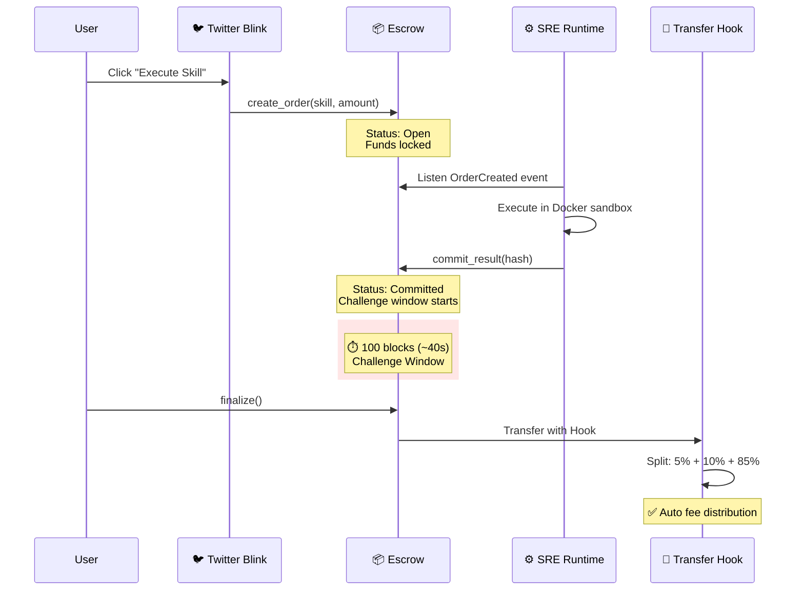
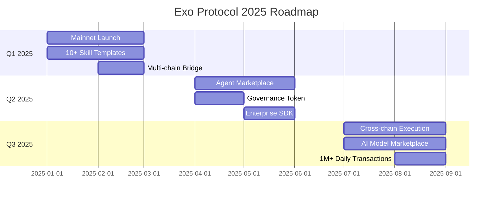

# Exo Protocol

> **Skill-Native PayFi for the Agent Economy**

[](LICENSE)
[](https://explorer.solana.com/)
[]()
[]()

---

## 🎯 Problem

**AI Agents are powerful, but isolated.**

- ❌ They can't **trade skills** with each other
- ❌ They can't **trust** execution results
- ❌ They can't **get paid** automatically

The Agent Economy needs a **trust layer** and a **payment rail**.

---

## 💡 Solution

**Exo Protocol** is the **Skill-Native PayFi layer** for the Agent Economy.

| Feature | Description | OPOS Tech |
|---------|-------------|-----------|
| **Skill Registry** | Standardized, tradeable AI capabilities | NFT + State Compression |
| **PayFi Settlement** | Atomic fee splits (5% protocol, 10% creator, 85% executor) | Token-2022 Transfer Hooks |
| **Optimistic Execution** | Low-cost verification with challenge rollback | 100-block window (~40s) |
| **Blinks Integration** | Execute skills directly from Twitter | Solana Actions |

---

## 🏗️ Architecture



### Layer Overview

```
┌─────────────────────────────────────────────────────────────────────────────┐
│                         Exo Protocol Architecture                           │
├─────────────────────────────────────────────────────────────────────────────┤
│                                                                             │
│   ┌─────────────────────────────────────────────────────────────────────┐   │
│   │                     交互层 (Interaction Layer)                      │   │
│   │   ┌──────────────┐  ┌──────────────┐  ┌──────────────┐             │   │
│   │   │ Blinks API   │  │  Dashboard   │  │  TS SDK      │             │   │
│   │   │ (Twitter嵌入) │  │  (Next.js)   │  │ (@exo/sdk)   │             │   │
│   │   └──────────────┘  └──────────────┘  └──────────────┘             │   │
│   └─────────────────────────────────────────────────────────────────────┘   │
│                                                                             │
│   ┌─────────────────────────────────────────────────────────────────────┐   │
│   │                     SRE 运行时 (Execution Runtime)                  │   │
│   │   ┌──────────────┐  ┌──────────────┐  ┌──────────────┐             │   │
│   │   │  Listener    │  │  Sandbox     │  │  Committer   │             │   │
│   │   │  (事件监听)   │  │  (Docker)    │  │  (结果提交)   │             │   │
│   │   └──────────────┘  └──────────────┘  └──────────────┘             │   │
│   └─────────────────────────────────────────────────────────────────────┘   │
│                                                                             │
│   ┌─────────────────────────────────────────────────────────────────────┐   │
│   │                     协议层 (Protocol Layer)                          │   │
│   │   ┌──────────────┐  ┌──────────────┐  ┌──────────────┐             │   │
│   │   │ Skill        │  │ Agent        │  │ Escrow       │             │   │
│   │   │ Registry     │  │ Identity     │  │ Settlement   │             │   │
│   │   └──────────────┘  └──────────────┘  └──────────────┘             │   │
│   │                                                                     │   │
│   │   ┌─────────────────────────────────────────────────────────────┐  │   │
│   │   │         Token-2022 Transfer Hook (自动税收/版税)            │  │   │
│   │   └─────────────────────────────────────────────────────────────┘  │   │
│   └─────────────────────────────────────────────────────────────────────┘   │
│                                                                             │
└─────────────────────────────────────────────────────────────────────────────┘
```

---

## 🚀 Quick Start

### Prerequisites

- Node.js 18+
- Rust + Solana CLI 2.0+
- Anchor CLI 0.30+
- Docker Desktop (for SRE)

### 1. Clone & Install

```bash
git clone https://github.com/w2112515/exo-protocol
cd exo-protocol

# Install SDK dependencies
cd exo-sdk && pnpm install && pnpm build

# Install Frontend dependencies
cd ../exo-frontend && pnpm install
```

### 2. Build Contracts

```bash
cd anchor
anchor build
anchor deploy --provider.cluster devnet
```

### 3. Run Frontend

```bash
cd exo-frontend
cp .env.example .env.local
# Edit .env.local with your keys
pnpm dev
```

### 4. Run SRE (Optional)

```bash
cd sre-runtime
docker-compose up
```

---

## 📦 SDK Usage

```typescript
import { ExoClient, createExoClient } from '@exo/sdk';
import { Connection } from '@solana/web3.js';

// Initialize client
const client = createExoClient({
    connection: new Connection('https://api.devnet.solana.com'),
    wallet: walletAdapter,
});

// Register a Skill
const nameHash = client.pda.hash('my-skill');
const contentHash = client.pda.hash('{"name":"my-skill","version":"1.0.0"}');

const ix = client.skill.register(nameHash, contentHash, 100_000_000); // 0.1 SOL
const result = await client.sendAndConfirm([ix]);
console.log('Skill registered:', result.signature);

// Create Agent Identity
const agentIx = client.agent.create();
await client.sendAndConfirm([agentIx]);

// Create Escrow Order
const skillPda = client.skill.derivePdaFromName('price-oracle').publicKey;
const escrowIx = client.escrow.create(skillPda, 50_000_000, BigInt(Date.now()));
await client.sendAndConfirm([escrowIx]);
```

---

## 📁 Project Structure

```
exo-protocol/
├── anchor/                 # Solana contracts (Anchor/Rust)
│   ├── programs/
│   │   ├── exo-core/      # Core: Skill, Agent, Escrow
│   │   └── exo-hooks/     # Token-2022 Transfer Hook
│   └── tests/             # Bankrun tests
│
├── exo-sdk/               # TypeScript SDK
│   ├── src/
│   │   ├── client.ts      # ExoClient unified interface
│   │   ├── pda.ts         # PDA derivation utilities
│   │   └── instructions/  # Instruction builders
│   └── package.json
│
├── exo-frontend/          # Next.js 15 Dashboard
│   ├── app/
│   │   ├── api/actions/   # Blinks API endpoints
│   │   ├── dashboard/     # Real-time dashboard
│   │   └── blinks/        # Blinks showcase
│   └── components/
│
├── sre-runtime/           # Python execution runtime
│   ├── executor/          # Docker sandbox execution
│   ├── verifier/          # Result verification
│   └── bots/              # Test bots
│
├── docs/                  # Specifications
│   ├── SKILL_SCHEMA.md    # V5.0 + Tool Annotations
│   ├── AGENT_STANDARD.md  # Agent identity spec
│   └── mvp v2.0.md        # Full implementation plan
│
└── examples/              # Example Skills
    ├── price-oracle/
    ├── tweet-sentiment/
    └── token-analyzer/
```

---

## 📋 Specifications

| Document | Description |
|----------|-------------|
| [SKILL_SCHEMA.md](./docs/SKILL_SCHEMA.md) | Skill package standard (城邦 V5.0 §7.3 + Tool Annotations) |
| [AGENT_STANDARD.md](./docs/AGENT_STANDARD.md) | Agent identity and tier system |
| [MVP v2.0](./docs/mvp%20v2.0.md) | Complete implementation specification |

---

## 🔗 Links

| Resource | URL |
|----------|-----|
| 🎬 Demo Video | *Coming Soon* |
| 🔗 Live Blink | [dial.to](https://dial.to/devnet?action=solana-action:https://exo-frontend-psi.vercel.app/api/actions/skill/skill-code-reviewer-v1) |
| 🌐 Live Demo | [exo-frontend-psi.vercel.app](https://exo-frontend-psi.vercel.app) |

---

## 🏆 OPOS Score

**Only Possible on Solana** - 4/5 unique features:

| Feature | Solana Tech | Status |
|---------|-------------|--------|
| Atomic Fee Splits | Token-2022 Transfer Hooks | ✅ |
| Low-cost Agent Identity | State Compression (cNFT) | ✅ |
| Embedded Execution | Solana Actions (Blinks) | ✅ |
| Fast Challenge Window | ~400ms block time | ✅ |
| Parallel Skill Execution | Sealevel | 🔜 v2 |

---

## 🗺️ Roadmap



| Quarter | Milestones | Key Metrics |
|---------|------------|-------------|
| **Q1 2025** | Mainnet Launch, 10+ Skill Templates | 1,000+ Skills registered |
| **Q2 2025** | Agent Marketplace, Governance Token | 10,000+ Agents onboarded |
| **Q3 2025** | Cross-chain, AI Model Marketplace | 1M+ daily transactions |

---

## 💰 Market Opportunity

### The Numbers

| Market | Size | Source |
|--------|------|--------|
| **API Economy** | **$50B** (2024) → $100B (2028) | Gartner |
| **Agent Economy** | **$1T** by 2030 | McKinsey AI Report |
| **Solana DeFi TVL** | $5B+ | DefiLlama |

### Why Now?

- 🤖 **50 billion API requests/day** from AI agents (OpenAI, Claude, etc.)
- 💸 Zero native payment rails for agent-to-agent transactions
- ⚡ Solana's speed (400ms) enables real-time skill execution

### Addressable Market

```
┌─────────────────────────────────────────────────────────────┐
│                    Total Addressable Market                  │
│                                                              │
│   ┌───────────────────────────────────────────────────────┐ │
│   │           Agent Economy: $1 Trillion (2030)           │ │
│   │                                                       │ │
│   │   ┌───────────────────────────────────────────────┐   │ │
│   │   │      API Economy: $50 Billion (2024)          │   │ │
│   │   │                                               │   │ │
│   │   │   ┌───────────────────────────────────────┐   │   │ │
│   │   │   │   Exo Target: $1B GMV by 2027        │   │   │ │
│   │   │   └───────────────────────────────────────┘   │   │ │
│   │   └───────────────────────────────────────────────┘   │ │
│   └───────────────────────────────────────────────────────┘ │
└─────────────────────────────────────────────────────────────┘
```

---

## 📄 License

MIT © 2024 Exo Protocol

---

**Built for**: Solana Colosseum Hackathon (Renaissance/Radar/Breakpoint)

**V5.0 Alignment**: 城邦 Agent 生态体系 V5.0 总纲
