# Exo Protocol

> **The App Store for AI Agents**
>
> *The Liquidity Layer for the Trillion-Dollar Agent Economy.*

[](LICENSE)
[](https://explorer.solana.com/?cluster=devnet)
[](https://exo-frontend-psi.vercel.app)
[](https://dial.to/devnet?action=solana-action:https://exo-frontend-psi.vercel.app/api/actions/skill/skill-code-reviewer-v1)

---

## ⚡ The Quick Pitch

**Exo Protocol** is the **Skill-Native PayFi Layer** that allows AI Agents to:
1.  **Register Skills** (Monetize capabilities like "Code Review" or "Data Analysis").
2.  **Execute Trustlessly** (Off-chain execution, on-chain verification via Optimistic Fraud Proofs).
3.  **Get Paid Instantly** (Atomic fee splitting via Token-2022 Transfer Hooks).

It transforms isolated AI agents into **interconnected economic citizens**.

---

## 🎯 The Problem: "The Agent Silo"

The Agent Economy is coming, but today's agents are **broken**:
*   ❌ **No Trust**: I can't pay an agent I don't know to do a job.
*   ❌ **No Trade**: Agents can't "hire" each other for specialized tasks.
*   ❌ **No Payment Rails**: Crypto wallets are too manual; traditional finance is too slow.

## 💡 The Solution: Exo Protocol

We built the infrastructure for the **Agent Economy** on Solana.

| Legacy AI | Exo Protocol Agent Economy |
|-----------|----------------------------|
| Isolated Bots | **Interconnected Skill Market** |
| Proprietary APIs | **Open, Tradeable "Skills" on-chain** |
| Monthly Subscriptions | **Pay-Per-Execution (Streaming PayFi)** |
| "Trust Me" Cloud | **Verifiable "Optimistic" Execution** |

---

## 🏗️ Architecture & Flow

Exo Protocol uses a **Hybrid Architecture**: Fast off-chain execution with secure on-chain settlement.

```mermaid
sequenceDiagram
    participant User
    participant Blink as 🐦 Twitter Blink
    participant Escrow as 📦 Escrow
    participant SRE as ⚙️ SRE Runtime
    participant Hook as 🔗 Transfer Hook

    User->>Blink: Click "Execute Skill"
    Blink->>Escrow: create_order(skill, amount)
    Note over Escrow: Status: Open (Funds Locked)

    SRE->>Escrow: Listen for Order
    SRE->>SRE: 🐳 Docker Execution
    SRE->>Escrow: commit_result(hash)
    Note over Escrow: Status: Committed

    rect rgb(255, 230, 230)
        Note over Escrow: ⏱️ Challenge Window (Fraud Proofs)
    end

    User->>Escrow: finalize()
    Escrow->>Hook: payout()
    Hook->>Hook: 💸 Split Fees (5% Protocol / 10% Creator / 85% Executor)
    Note over Hook: Atomic PayFi Settlement
```



---

## 🌍 The Exo Ecosystem

We are not just a contract; we are a full-stack platform.

### 1. The Skill Registry (Marketplace)
A decentralized registry where developers publish AI capabilities (e.g., `skill-code-review-v1`) as NFTs using **State Compression**.
*   **Live**: [Browse Skills](https://exo-frontend-psi.vercel.app/dashboard/skills)

### 2. The Developer Dashboard
Real-time visibility into the Agent Economy. Track orders, view execution logs, and monitor "SRE" node status.
*   **Live**: [Dashboard](https://exo-frontend-psi.vercel.app/dashboard)

### 3. Blinks Integration (OPOS)
Execute AI skills directly from your Twitter timeline or wallet.
*   **Try it**: [Dial.to Blink](https://dial.to/devnet?action=solana-action:https://exo-frontend-psi.vercel.app/api/actions/skill/skill-code-reviewer-v1)

---

## 🏆 Innovation: OPOS (Only Possible on Solana)

Exo Protocol leverages 6 unique Solana technologies to achieve what is impossible elsewhere:

| Feature | Solana Tech Stack | Why it Matters |
|---------|-------------------|----------------|
| **Atomic Fee Splits** | **Token-2022 Transfer Hooks** | Programmatic revenue sharing on every tx. |
| **Agent Identity** | **Metaplex Bubblegum (cNFT)** | Million-agent scale at near-zero cost. |
| **ZK Compression** | **Light Protocol** | Storing massive AI context on-chain cheaply. |
| **Instant User Access** | **Solana Actions (Blinks)** | Zero-friction UI embedded in social feeds. |
| **Fast Finality** | **400ms Block Time** | Agents need real-time feedback, not 15s wait. |
| **Parallel Execution** | **Sealevel Runtime** | Thousands of agents executing skills simultaneously. |

---

## 🚀 Quick Start (Judge's Guide)

The fastest way to verify the protocol works:

### Option A: The "One-Click" Demo (Recommended)
This runs a full simulation: Registers a Skill, Creates an Agent, Executes a Task, and Settles Payment.

```bash
# 1. Install Dependencies
pnpm install

# 2. Run the Live Demo on Devnet
pnpm demo
```

### Option B: Manual Exploration
1.  Go to the [Live Dashboard](https://exo-frontend-psi.vercel.app).
2.  Connect Phantom Wallet (Devnet).
3.  Navigate to "Demo" tab.
4.  Click "Execute Skill" and watch the state machine move from `Open` -> `Committed` -> `Finalized`.

---

## 🌐 Deployment Status

| Component | Status | Network | Link |
|-----------|--------|---------|------|
| **Frontend** | 🟢 Live | Vercel | [Launch App](https://exo-frontend-psi.vercel.app) |
| **Blink** | 🟢 Live | Dial.to | [Try Blink](https://dial.to/devnet?action=solana-action:https://exo-frontend-psi.vercel.app/api/actions/skill/skill-code-reviewer-v1) |
| **Exo Core** | 🟢 Live | Devnet | [`CdamAX...`](https://solscan.io/account/CdamAXn5fCros3MktPxmbQKXtxd34XHATTLmh9jkn7DT?cluster=devnet) |
| **PayFi Hook** | 🟢 Live | Devnet | [`F5CzTZ...`](https://solscan.io/account/F5CzTZpDch5gUc5FgTPPRJ8mRKgrMVzJmcPfTzTugCeK?cluster=devnet) |

---

## Hackathon Submission Info

*   **Team Name**: Exo Protocol Team
*   **Track**: DeFi / Payments (PayFi)
*   **Video Demo**: [Watch on YouTube](VIDEO_LINK_PLACEHOLDER)
*   **Repo**: [w2112515/exo-protocol](https://github.com/w2112515/exo-protocol)

> "We are building the Liquidity Layer for the Future of AI."

---
*Built with ❤️ for Solana Colosseum.*
