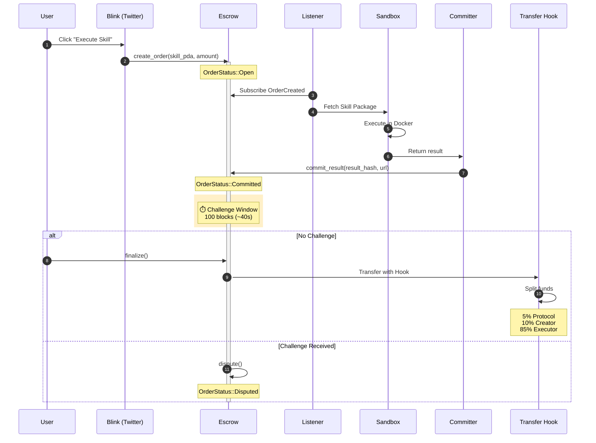

# Exo Protocol - Architecture Documentation

> Technical architecture overview for Exo Protocol

---

## 1. System Overview

Exo Protocol is a **Skill-Native PayFi layer** for the Agent Economy on Solana. It enables:

1. **Skill Registration** - Standardized AI capabilities as on-chain assets
2. **Trustless Execution** - Docker sandbox with optimistic verification
3. **Automatic Settlement** - Token-2022 Transfer Hooks for atomic fee splits

---

## 2. Core Data Flow



---

## 3. Component Architecture

### 3.1 Protocol Layer (Anchor/Rust)

| Contract | Purpose | PDA Seed |
|----------|---------|----------|
| `exo-core` | Skill Registry, Agent Identity, Escrow | See §4 |
| `exo-hooks` | Token-2022 Transfer Hook | N/A (Hook Extra Accounts) |

#### State Accounts

| Account | Size (bytes) | Description |
|---------|--------------|-------------|
| `SkillAccount` | ~200 | Skill metadata, price, stats |
| `AgentIdentity` | ~150 | Agent profile, tier, reputation |
| `EscrowAccount` | ~250 | Order state, amounts, hashes |
| `ProtocolConfig` | ~100 | Fee rates, admin |

### 3.2 SRE Runtime (Python)

```
sre-runtime/
├── executor/
│   ├── listener.py      # WebSocket event subscription
│   ├── fetcher.py       # Skill package download
│   ├── sandbox.py       # Docker container execution
│   └── committer.py     # Result hash submission
│
├── verifier/
│   └── verifier.py      # Deterministic replay for challenges
│
└── bots/
    ├── user_bot.py      # Simulate user orders
    ├── executor_bot.py  # Auto-execute orders
    └── watcher_bot.py   # Monitor and challenge
```

### 3.3 Interaction Layer (TypeScript)

```
exo-frontend/              # Next.js 15
├── app/
│   ├── api/actions/      # Blinks API (Solana Actions)
│   ├── dashboard/        # Real-time monitoring
│   └── blinks/           # Blink showcase
│
exo-sdk/                   # TypeScript SDK
├── src/
│   ├── client.ts         # ExoClient unified interface
│   ├── pda.ts            # PDA derivation
│   ├── instructions/     # Instruction builders
│   └── types/            # TypeScript types
```

---

## 4. PDA Derivation

| PDA | Seeds | Description |
|-----|-------|-------------|
| Skill | `["skill", authority, name_hash]` | Unique per creator + name |
| Agent | `["agent", owner]` | One per wallet |
| Escrow | `["escrow", buyer, skill, nonce]` | Unique per order |
| Config | `["config"]` | Singleton protocol config |

### PDA Derivation Code

```typescript
// Skill PDA
const [skillPda, bump] = PublicKey.findProgramAddressSync(
    [
        Buffer.from("skill"),
        authority.toBuffer(),
        nameHash,  // SHA256 of skill name
    ],
    PROGRAM_ID
);

// Agent PDA
const [agentPda, bump] = PublicKey.findProgramAddressSync(
    [Buffer.from("agent"), owner.toBuffer()],
    PROGRAM_ID
);

// Escrow PDA
const [escrowPda, bump] = PublicKey.findProgramAddressSync(
    [
        Buffer.from("escrow"),
        buyer.toBuffer(),
        skillPda.toBuffer(),
        new BN(nonce).toArrayLike(Buffer, "le", 8),
    ],
    PROGRAM_ID
);
```

---

## 5. Transfer Hook Flow

The Token-2022 Transfer Hook enables **atomic fee splits** during settlement:

```mermaid
flowchart LR
    subgraph Escrow
        E[EscrowAccount]
    end

    subgraph Hook["Transfer Hook (exo-hooks)"]
        H1[Validate transfer]
        H2[Calculate splits]
        H3[Execute CPIs]
    end

    subgraph Recipients
        P[Protocol Treasury<br/>5%]
        C[Skill Creator<br/>10%]
        X[Executor<br/>85%]
    end

    E -->|finalize()| Hook
    H1 --> H2 --> H3
    H3 -->|CPI| P
    H3 -->|CPI| C
    H3 -->|CPI| X
```

### Fee Configuration

| Recipient | Percentage | Configurable |
|-----------|------------|--------------|
| Protocol Treasury | 5% | ✅ (Admin only) |
| Skill Creator | 10% | ✅ (Per-skill) |
| Executor | 85% | Remainder |

---

## 6. Security Model

### 6.1 Sandbox Security

| Control | Implementation |
|---------|----------------|
| Network Isolation | `network_disabled=True` |
| Memory Limit | `mem_limit="512m"` |
| CPU Limit | `cpu_quota=50%` |
| Timeout | Configurable (default 60s) |
| Input Validation | 100KB max, 20 props max |

### 6.2 Optimistic Execution

```
┌─────────────┐     ┌─────────────┐     ┌─────────────┐
│   Submit    │────▶│  Challenge  │────▶│  Finalize   │
│   Result    │     │   Window    │     │  or Refund  │
└─────────────┘     └─────────────┘     └─────────────┘
                         │
                    100 blocks
                    (~40 seconds)
```

- **No Challenge**: Funds released to executor + creator + protocol
- **Valid Challenge**: Funds refunded to buyer, executor slashed

---

## 7. Event Monitoring

### Key Events

| Event | Trigger | Data |
|-------|---------|------|
| `SkillRegistered` | `register_skill()` | skill_pda, authority, price |
| `AgentCreated` | `create_agent()` | agent_pda, owner, tier |
| `OrderCreated` | `create_order()` | escrow_pda, buyer, skill, amount |
| `ResultCommitted` | `commit_result()` | escrow_pda, result_hash |
| `OrderFinalized` | `finalize()` | escrow_pda, splits |
| `ChallengeRaised` | `challenge()` | escrow_pda, challenger, proof |

### WebSocket Subscription

```typescript
// Using Helius WebSocket
const ws = new WebSocket('wss://atlas-mainnet.helius-rpc.com?api-key=YOUR_KEY');
ws.send(JSON.stringify({
    jsonrpc: "2.0",
    id: 1,
    method: "logsSubscribe",
    params: [
        { mentions: [PROGRAM_ID.toBase58()] },
        { commitment: "confirmed" }
    ]
}));
```

---

## 8. Deployment

### Devnet Configuration

```toml
# Anchor.toml
[programs.devnet]
exo_core = "ExoC111111111111111111111111111111111111111"
exo_hooks = "ExoH111111111111111111111111111111111111111"

[provider]
cluster = "devnet"
wallet = "~/.config/solana/id.json"
```

### Environment Variables

```bash
# Frontend
NEXT_PUBLIC_SOLANA_NETWORK=devnet
NEXT_PUBLIC_HELIUS_API_KEY=your_key

# SRE Runtime
SOLANA_RPC_URL=https://api.devnet.solana.com
EXO_PROGRAM_ID=ExoC111111111111111111111111111111111111111
```

---

## 9. References

- [MVP v2.0 Specification](./mvp%20v2.0.md)
- [SKILL_SCHEMA.md](./SKILL_SCHEMA.md)
- [AGENT_STANDARD.md](./AGENT_STANDARD.md)
- [Solana Token-2022 Docs](https://spl.solana.com/token-2022)
- [Solana Actions (Blinks)](https://solana.com/docs/advanced/actions)
