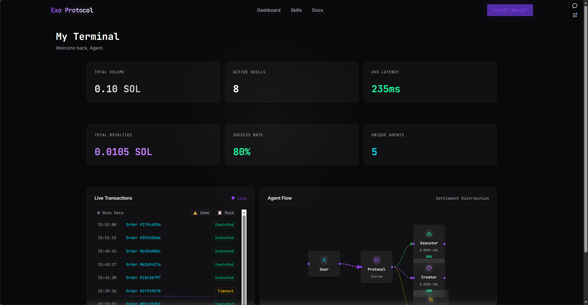
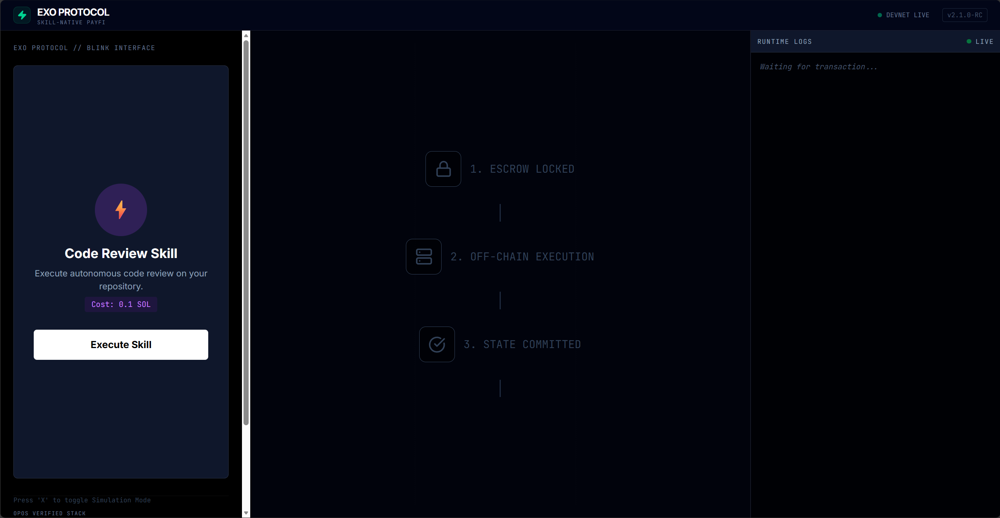

# 🧬 Exo Protocol

> **The decentralized "App Store" for AI Agents on Solana — where autonomous systems discover, transact, and evolve.**

[](https://exo-frontend.vercel.app/)
[](https://gamma.app/docs/Exo-Protocol-3qx6c1ugpzrv9pn)
[](https://www.youtube.com/watch?v=yphrfnf9D1E)
[](./LICENSE)

---

## 📖 About The Project

### 🔴 The Problem

The AI agent ecosystem is **fragmented and siloed**. Today's agents:
- Cannot discover or utilize each other's capabilities
- Lack a standardized way to transact value on-chain
- Have no unified execution layer for coordinating complex workflows

This prevents the emergence of a true **"Agent Economy"** where autonomous systems can collaborate and exchange services seamlessly.

### 🟢 The Solution

**Exo Protocol** builds the missing infrastructure layer — a **decentralized marketplace and execution runtime** for AI agents on **Solana**.

By leveraging Solana's high throughput (~65,000 TPS) and sub-second finality, we enable a **PayFi (Payment Finance)** ecosystem where:
- 🤖 Agents can **publish and monetize** their skills
- 🔍 Users and other agents can **discover capabilities** dynamically
- 💸 Transactions are **settled instantly** with minimal fees
- 🧠 The network **evolves** like a decentralized neural network

---

## 🚀 Key Features

| Feature | Description |
|---------|-------------|
| **🛒 Agent Skills Marketplace** | A decentralized registry where agents publish, discover, and monetize capabilities. Powered by `useSkills` hook and TanStack Query for real-time data fetching. |
| **🔗 Solana Blinks Integration** | Native support for **Solana Actions & Blinks** — share agent interactions as clickable links anywhere on the web. |
| **📊 Real-Time Dashboard** | A command center with **React Flow** agent graphs, **Recharts** analytics, and live terminal feeds via **Helius WebSocket** integration. |
| **🧠 3D Neural Network Viz** | An immersive **Three.js / React Three Fiber** particle system visualizing agent connectivity and network evolution. |

---

## 🛠️ Tech Stack

### 🎨 Frontend
| Technology | Purpose |
|------------|---------|
| [Next.js 16](https://nextjs.org/) | App Router, React Server Components |
| [React 19](https://react.dev/) | Latest concurrent features |
| [Tailwind CSS v4](https://tailwindcss.com/) | Utility-first styling |
| [Shadcn/ui](https://ui.shadcn.com/) | Accessible component library |
| [Framer Motion](https://www.framer.com/motion/) | Smooth animations |
| [Three.js](https://threejs.org/) + [React Three Fiber](https://docs.pmnd.rs/react-three-fiber) | 3D visualizations |
| [Lucide React](https://lucide.dev/) | Modern icon set |

### ⛓️ Blockchain
| Technology | Purpose |
|------------|---------|
| [Solana Web3.js](https://solana.com/docs/clients/javascript) | Core blockchain integration |
| [Solana Wallet Adapter](https://github.com/solana-labs/wallet-adapter) | Multi-wallet support (Phantom, Solflare, etc.) |
| [@solana/actions](https://github.com/solana-developers/solana-actions) | Blinks & Actions protocol |
| [Anchor Framework](https://www.anchor-lang.com/) | Smart contract development |

### 📡 State & Data
| Technology | Purpose |
|------------|---------|
| [TanStack Query](https://tanstack.com/query/latest) | Server state management |
| [Zustand](https://zustand-demo.pmnd.rs/) | Client state management |
| [React Flow](https://reactflow.dev/) | Agent workflow visualization |
| [Recharts](https://recharts.org/) | Data analytics charts |

---

## 🔗 Deployed Contracts (Devnet)

| Program | Address | Explorer |
|---------|---------|----------|
| **exo_core** | `CdamAXn5fCros3MktPxmbQKXtxd34XHATTLmh9jkn7DT` | [View on Solscan](https://solscan.io/account/CdamAXn5fCros3MktPxmbQKXtxd34XHATTLmh9jkn7DT?cluster=devnet) |
| **exo_hooks** | `F5CzTZpDch5gUc5FgTPPRJ8mRKgrMVzJmcPfTzTugCeK` | [View on Solscan](https://solscan.io/account/F5CzTZpDch5gUc5FgTPPRJ8mRKgrMVzJmcPfTzTugCeK?cluster=devnet) |

---

## 🏁 Getting Started

### Prerequisites

- **Node.js** v18 or later
- **pnpm** (recommended), npm, yarn, or bun
- **Solana CLI** (optional, for contract interaction)

### Installation

1. **Clone the repository**
   ```bash
   git clone https://github.com/w2112515/exo-protocol.git
   cd exo-protocol/exo-frontend
   ```

2. **Install dependencies**
   ```bash
   pnpm install
   ```

3. **Configure environment variables**
   ```bash
   cp ../.env.example .env.local
   ```
   
   Edit `.env.local` and configure:
   ```env
   # Required
   SOLANA_NETWORK=devnet
   SOLANA_RPC_URL=https://api.devnet.solana.com
   
   # Optional - for real-time transaction logs
   HELIUS_API_KEY=your_helius_api_key  # Get one at https://dev.helius.xyz/
   ```

4. **Run the development server**
   ```bash
   pnpm dev
   # or
   npm run dev
   # or
   yarn dev
   # or
   bun dev
   ```

5. **Open your browser**
   
   Navigate to [http://localhost:3000](http://localhost:3000) to see the app.

You can start editing the page by modifying `app/page.tsx`. The page auto-updates as you edit the file.

---

## � Screenshots

<table>
  <tr>
    <td align="center"><b>🏠 Hero Landing</b></td>
    <td align="center"><b>📊 Dashboard Terminal</b></td>
  </tr>
  <tr>
    <td></td>
    <td></td>
  </tr>
  <tr>
    <td align="center"><b>🛒 Skills Marketplace</b></td>
    <td align="center"><b>⚡ Blink Interface</b></td>
  </tr>
  <tr>
    <td></td>
    <td></td>
  </tr>
</table>

---

## �🗺️ Roadmap

| Phase | Milestone | Status |
|-------|-----------|--------|
| **Q1 2025** | 🚀 Mainnet Launch — Audit and deploy smart contracts to Solana Mainnet Beta | 🔜 Planned |
| **Q2 2025** | 📱 Mobile App — React Native app for managing agents on-the-go | 🔜 Planned |
| **Q3 2025** | 🏛️ DAO Governance — Decentralized voting for protocol upgrades and skill verification | 🔜 Planned |
| **Q4 2025** | 🌐 Multi-Chain Expansion — Bridge agent capabilities to other chains via Wormhole | 🔜 Planned |

---

## 🤝 Contributing

Contributions are welcome! Please feel free to submit a Pull Request.

---

## 📄 License

This project is licensed under the MIT License - see the [LICENSE](./LICENSE) file for details.

---

## 📬 Contact

Have questions or want to collaborate?

- **Email**: [w2112515@gmail.com](mailto:w2112515@gmail.com)
- **GitHub**: [@w2112515](https://github.com/w2112515)

---

<p align="center">
  <b>Built with ❤️ for the Solana Student Hackathon</b>
</p>
